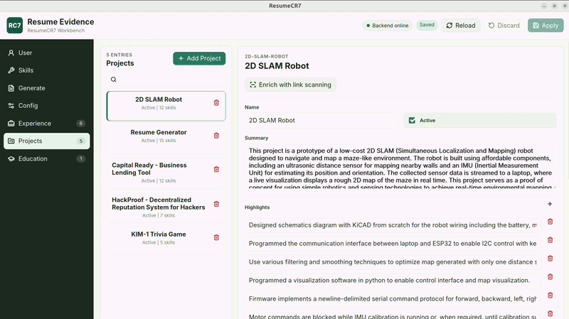
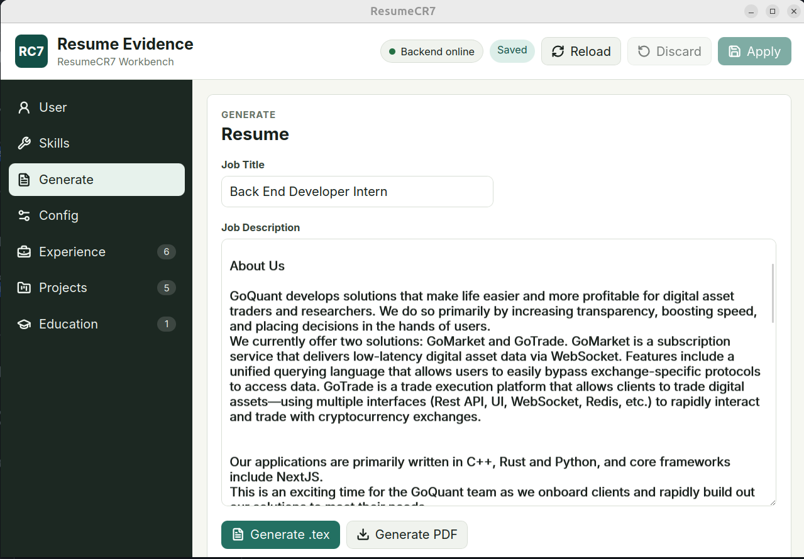
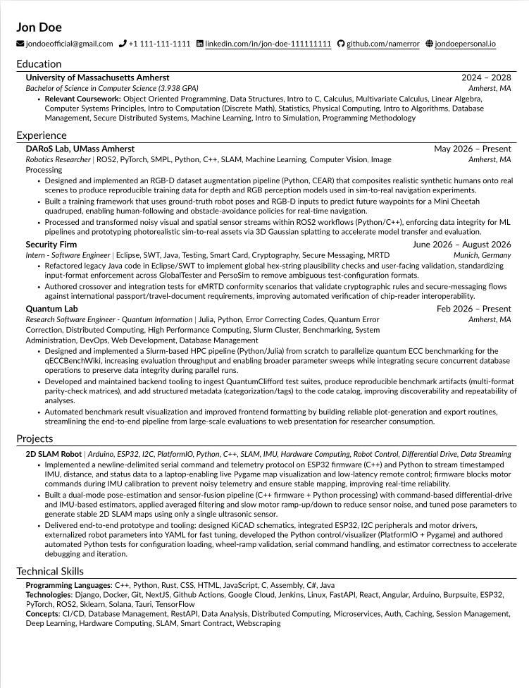

# ResumeCR7

**Never stare at a blank resume again.**

Stop trying to remember everything you have done. ResumeCR7 gives you a local
place to keep concrete evidence from projects, jobs, education, and skills, then
turns that evidence into a tailored, ATS-friendly resume when you need one.

It is not a chatbot wrapper. The core workflow is to maintain your own career
record first, then generate outputs from that record. Job descriptions can guide
selection and phrasing, but they are not treated as evidence.

## Who It Is For

ResumeCR7 is for people who repeatedly need to explain their work clearly:

- Software engineers, students, and builders with project-heavy experience.
- Job seekers who tailor resumes for different roles.
- Freelancers or contractors who reuse the same work history in different
  formats.
- Anyone whose accomplishments are spread across GitHub, notes, tickets,
  portfolio pages, and memory.

## Why Not Just Use ChatGPT?

ChatGPT can help rewrite a resume, but you still have to remember and paste the
right facts every time. ResumeCR7 solves a different problem:

- Your evidence is structured and reusable instead of trapped in one prompt.
- Generated bullets are grounded in facts you authored or explicitly enriched.
- Skill and project selection can run deterministically with baseline fallbacks.
- Local YAML files remain inspectable, editable, and portable.
- The immediate output is a tailored `.tex` resume artifact, with optional PDF
  rendering, from the same maintained career record.

## Key Features

- Local resume evidence for contact info, skills, projects, experience, and
  education.
- React/Vite workbench for editing evidence, staging changes, setting a target
  role, generating LaTeX, downloading PDFs, and enriching linked evidence.
- FastAPI backend with resume evidence CRUD and a `/resume-generation` facade.
- Grounded skill, project, job-focus, and bullet generation services.
- Deterministic baseline skill and project selection with optional OpenAI-backed
  methods.
- Local-first desktop shell using Tauri v2 and a packaged FastAPI sidecar.
- Runtime data bootstrap that creates schema-valid local files without
  overwriting existing user-authored evidence.

## Screenshots

### Maintain Project Evidence



### Generate For A Target Role



### Export A Resume



## Quick Start

### Requirements

- Python 3.12+
- [uv](https://docs.astral.sh/uv/) for Python dependency management
- Node.js and npm for the frontend
- Optional: `latexmk` and a TeX installation for PDF rendering

### Local Web Workbench

Install backend and frontend dependencies:

```bash
uv sync --extra dev
cd frontend
npm install
```

Run the backend:

```bash
uv run resumecr7-api --reload
```

In another terminal, run the workbench:

```bash
cd frontend
npm run dev
```

The Vite dev server proxies `/api/*` to `http://127.0.0.1:8000` by default.
Open the Vite URL shown by npm.

### Desktop App

Build the desktop app from the frontend directory:

```bash
cd frontend
npm install
npm run desktop:build
```

On Ubuntu, Tauri builds require WebView/GTK dependencies:

```bash
sudo apt-get update
sudo apt-get install -y \
  build-essential \
  pkg-config \
  libwebkit2gtk-4.1-dev \
  libgtk-3-dev \
  libayatana-appindicator3-dev \
  librsvg2-dev
```

The desktop shell starts a bundled backend sidecar on `127.0.0.1`, waits for
`/health`, and passes the backend URL to the frontend.

### CLI

Edit local evidence through the terminal:

```bash
uv run resumecr7-resume-evidence
uv run resumecr7-resume-evidence --schema projects
uv run resumecr7-resume-evidence --schema skills
uv run resumecr7-resume-evidence --schema education
uv run resumecr7-resume-evidence --schema experience
uv run resumecr7-resume-evidence --schema user
```

Run resume generation:

```bash
uv run resumecr7-resume-generation
```

Render an existing LaTeX artifact to PDF:

```bash
PYTHONPATH=. python -m resume_generation.pdf
```

## Runtime Data

ResumeCR7 stores local user data under `RESUMECR7_DATA_DIR`. In local
development, the default is the repository `user/` directory. In the packaged
desktop app, Tauri provides the OS app-data directory for
`com.resumecr7.desktop`.

Typical desktop locations:

```text
Linux:   $XDG_DATA_HOME/com.resumecr7.desktop or ~/.local/share/com.resumecr7.desktop
macOS:   ~/Library/Application Support/com.resumecr7.desktop
Windows: %APPDATA%\com.resumecr7.desktop
```

Runtime layout:

```text
RESUMECR7_DATA_DIR/
  resume_evidence/
    user.yaml
    skills.yaml
    projects.yaml
    education.yaml
    experience.yaml
  resume_generation/
    config.yaml
    job_target.yaml
    artifacts/
      resume_result.json
      resume_run_manifest.json
      resume.tex
      resume.pdf
  logs/
    resumecr7.log
    desktop-sidecar.log
```

The `user/` directory is intentionally ignored by git. Safe fictional examples
live under `examples/`.

## Evidence Model

Resume evidence is the source of truth. Implemented evidence files are:

- `user.yaml`: contact/header fields.
- `skills.yaml`: categorized skills under `technology`, `programming`, and
  `concepts`.
- `projects.yaml`: project records with summaries, highlights, active flags,
  categorized skills, and optional links.
- `experience.yaml`: work records with role, dates, location, highlights,
  categorized skills, and optional links.
- `education.yaml`: education records with degree, dates, location, grade, and
  relevant coursework.

See `examples/resume_evidence/` for safe starter files.

## API Surface

Start the backend:

```bash
uv run resumecr7-api --reload
```

OpenAPI docs are available at `http://127.0.0.1:8000/docs`.

Primary product routes:

| Method | Path | Purpose |
|---|---|---|
| `GET` | `/health` | Service liveness, effective config, and runtime paths |
| `GET` | `/metrics-lite` | Aggregate request/error/latency/token counters |
| `GET` | `/resume-evidence` | Load all registered resume evidence |
| `GET/PUT` | `/resume-evidence/user` | Read or replace contact evidence |
| `GET/PUT` | `/resume-evidence/skills` | Read or replace skills evidence |
| `GET/POST` | `/resume-evidence/projects` | List or create projects |
| `GET/PUT/DELETE` | `/resume-evidence/projects/{id}` | Read, replace, or delete a project |
| `GET/POST` | `/resume-evidence/experience` | List or create experience records |
| `GET/PUT/DELETE` | `/resume-evidence/experience/{id}` | Read, replace, or delete experience |
| `GET/POST` | `/resume-evidence/education` | List or create education records |
| `GET/PUT/DELETE` | `/resume-evidence/education/{id}` | Read, replace, or delete education |
| `POST` | `/resume-generation/tex` | Run the full resume pipeline and return `.tex` |
| `POST` | `/resume-generation/pdf` | Render the current `.tex` artifact and return PDF bytes |
| `POST` | `/resume-generation/enrich-link-evidence` | Enrich project or experience evidence from links |

Lower-level capability routes are also available for testing and integration:
`/select-skills`, `/select-projects`, `/derive-job-focus`,
`/generate-bulletpoints`, and `/enrich-link-evidence`.

## Configuration

ResumeCR7 reads environment settings through `app/config.py` and per-run resume
generation settings through `resume_generation/config.yaml` in the active data
directory.

Common environment variables:

```bash
RESUMECR7_DATA_DIR=user
RESUMECR7_PACKAGED=false
SKILL_METHOD=baseline        # baseline, embeddings, llm
SKILL_TOP_N=10
PROJ_METHOD=llm              # baseline, llm
DEV_MODE=true
LOG_LEVEL=INFO
OPENAI_API_KEY=your_key_here
```

`OPENAI_API_KEY` is only required for embeddings, LLM-backed selection,
job-focus generation, bullet generation, and enabled link scanning. Baseline
paths remain functional without it.

## Repository Structure

```text
app/                      FastAPI backend and product services
frontend/                 React/Vite workbench and Tauri desktop shell
resume_evidence/          compatibility shims and CLI entrypoints
resume_generation/        compatibility shims and CLI entrypoints
data/                     durable evaluation and skill-pool assets
examples/                 fictional evidence/config examples
tests/                    backend test suite
scripts/                  build, eval, and release helper scripts
docs/
  architecture-overview.md
  development.md
  decisions/
  screenshots/
```

Start architecture work with `docs/architecture-overview.md` and
`docs/development.md`.

## Contributing

1. Create a focused branch.
2. Install dependencies with `uv sync --extra dev` and `cd frontend && npm install`.
3. Add or update tests for non-trivial behavior changes.
4. Run backend tests with `uv run pytest`.
5. Run frontend checks with `cd frontend && npm test && npm run build`.
6. For release metadata changes, run
   `uv run python scripts/validate_release.py --tag vX.Y.Z`.
7. Open a pull request that explains the user-visible behavior and test
   coverage.

Development guardrails:

- Do not invent resume claims or skills that were not provided as evidence.
- Respect `technology`, `programming`, and `concepts` category boundaries.
- Keep deterministic baseline behavior working even when optional model-backed
  paths fail.
- Keep user-authored evidence separate from generated artifacts.

## Roadmap

Near-term work:

- Support for Windows and macOS desktop builds.
- Signed installers before broad desktop distribution.
- Automatic updater integration.
- Async generation-run lifecycle after the local facade shape stabilizes.
- Easier manipulation, editing of generated resume, maybe a real-time editor.
- Quicker generation with multithreaded or multiprocess LLM calls.
- Wider LLM support (currently only OpenAI), including open-source models and local inference.
- More resume templates and auto-formatting. For example, dynamic font sizing, line spacing, and page breaks based on content length. Or an estimation/warning if the current content will not fit on a single page.
