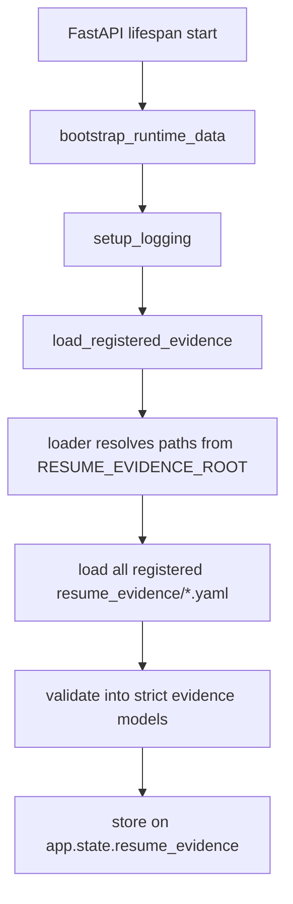
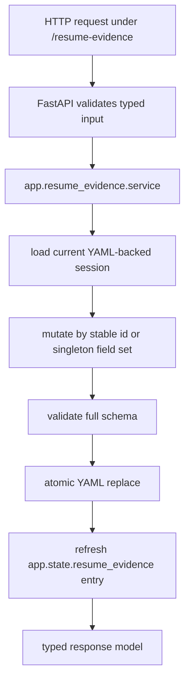
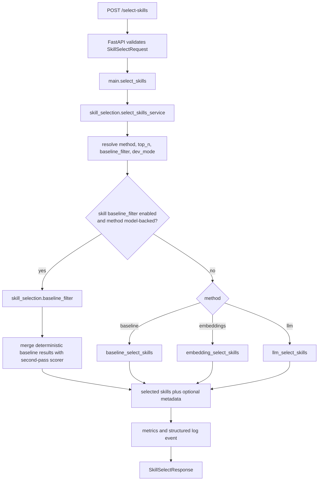
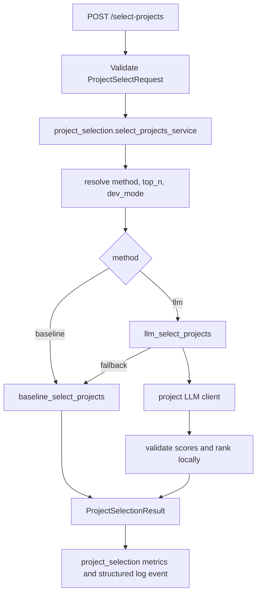
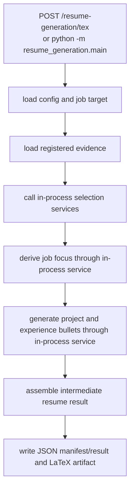

# Architecture Overview

This document maps the current ResumeCR7 structure so agents can move quickly across the resume-engine subsystems: FastAPI backend capabilities, grounded resume evidence, local resume-generation orchestration, and the planned service facade.

## 1) High-Level Structure

- `app/main.py`
  - FastAPI app composition, lifespan setup, HTTP routes, startup evidence loading
- `app/config.py`
  - scoped runtime settings loaded from environment for selection, generation, link scanning, and observability
- `app/metrics.py`
  - in-memory aggregate and per-subsystem request, error, latency, and token counters
- `app/logging_config.py`
  - structured logging setup
- `app/skill_selection/`
  - skill-selection models, service wrapper, baseline filter, model clients, scoring logic, role profiles, synonym map, and embedding caches
- `app/project_selection/`
  - project-selection models, API service wrapper, selector, baseline/LLM rankers, and project LLM client
- `app/job_focus_generation/`
  - job-focus derivation models, service wrapper, and LLM client
- `app/bulletpoints_generation/`
  - grounded bullet-point generation models, service wrapper, and LLM client
- `app/link_scanning/`
  - standalone evidence enrichment models, service wrapper, and LLM client
- `app/resume_evidence/`
  - strict evidence schemas, registry loading, ID-oriented service helpers, FastAPI CRUD routes, and staged CRUD/session logic
- `app/resume_generation/`
  - backend-owned resume generation orchestration, batch link enrichment, LaTeX/PDF artifact rendering, and `/resume-generation` facade routes
- `resume_evidence/`
  - legacy compatibility shims plus the local CLI entrypoint
- `resume_generation/`
  - legacy compatibility shims for existing imports and local module entrypoints
- `frontend/src-tauri/`
  - Tauri v2 desktop shell, platform bundle config, and packaged FastAPI sidecar launch
- `packaging/`
  - OS-specific helper scripts for checking or installing optional PDF rendering dependencies
- `app/skill_selection/selector.py`
  - API orchestration for method selection, metrics, logging, and response shaping
- `app/models.py`, `app/scoring/*`, `app/services/*`
  - compatibility shims for legacy import paths; new code should use subsystem paths

## 2) Module Dependency Map

```text
app.main
  -> app.config
  -> app.metrics
  -> app.logging_config
  -> app.skill_selection
  -> app.project_selection
  -> app.job_focus_generation
  -> app.bulletpoints_generation
  -> app.link_scanning
  -> app.resume_evidence

app.skill_selection.selector
  -> app.config
  -> app.metrics
  -> app.skill_selection.models
  -> app.skill_selection.baseline_filter
  -> app.skill_selection.scoring

app.skill_selection.scoring.baseline
  -> app.skill_selection.scoring.synonyms
  -> app.skill_selection.scoring.role_profiles
  -> app.skill_selection.data

app.skill_selection.scoring.embeddings
  -> app.skill_selection.embedding_client
  -> app.skill_selection.embedding_cache

app.skill_selection.scoring.llm
  -> app.skill_selection.scoring.baseline
  -> app.skill_selection.llm_client

app.project_selection.service
  -> app.metrics
  -> app.project_selection.selector

app.project_selection
  -> app.resume_evidence.models
  -> app.skill_selection.scoring.baseline
  -> app.project_selection.llm_client

app.job_focus_generation
  -> app.metrics
  -> app.job_focus_generation.llm_client

app.bulletpoints_generation
  -> app.metrics
  -> app.resume_evidence.models
  -> app.bulletpoints_generation.llm_client

app.link_scanning
  -> app.metrics
  -> app.resume_evidence.models
  -> app.link_scanning.llm_client

app.resume_evidence
  -> app.resume_evidence.loader
  -> app.resume_evidence.models
  -> app.resume_evidence.session
  -> app.resume_evidence.service
  -> user/resume_evidence/*.yaml

app.resume_generation
  -> app.resume_evidence
  -> app skill/project/focus/bullet services
  -> app.link_scanning
  -> user/resume_generation/config.yaml
  -> user/resume_generation/job_target.yaml

resume_generation compatibility shims
  -> app.resume_generation

app.resume_evidence.loader
  -> app.resume_evidence.models
  -> user/resume_evidence/education.yaml
  -> user/resume_evidence/experience.yaml
  -> user/resume_evidence/projects.yaml
  -> user/resume_evidence/skills.yaml
  -> user/resume_evidence/user.yaml

app.resume_evidence.session
  -> app.resume_evidence.loader
  -> app.resume_evidence.models

legacy compatibility shims
  -> app.skill_selection.*
  -> app.project_selection.llm_client
```

## 3) Startup And Runtime Flow

### FastAPI startup



- Startup creates missing runtime directories and schema-valid default YAML files before loading the registered evidence set into `app.state.resume_evidence`.
- Today that registry contains `education`, `experience`, `projects`, `skills`, and `user`.
- This startup hook validates local file-backed evidence for the current backend runtime. The product-facing evidence CRUD API now routes access through `app.resume_evidence` service helpers while still using configurable local YAML storage by default.

### Resume-evidence CRUD flow



- `projects`, `experience`, and `education` expose collection and item routes with stable ID URLs.
- `user` and `skills` are singleton resources with `GET` and `PUT`.
- Top-level `resume_evidence` imports remain as legacy compatibility shims for the CLI.

### Skill-selection request flow



### Project-selection request flow



### Resume-generation flow



- The full pipeline is backend-owned orchestration in `app/resume_generation/`.
- Top-level `resume_generation/` remains a compatibility entrypoint for existing local commands and imports.
- Stage calls use app service functions by default, not loopback HTTP.
- Generated artifacts under `user/resume_generation/` are derived runtime state, not source evidence.

## 4) Current Skill-Selection Logic

### Baseline scorer

`baseline_select_skills(...)` processes each category independently using shared rules:

1. Detect role family from `job_role`.
2. Normalize skills using the synonym map.
3. Load and normalize role-profile keywords.
4. Score exact or token-boundary matches above weaker partial matches.
5. Sort deterministically with stable tie-breaking.
6. Return selected skills, plus dev metadata when enabled.

### Model-backed methods

- `embeddings`
  - scores via embedding similarity and keeps deterministic response ordering locally
- `llm`
  - scores through the Responses API, validates output locally, and falls back to baseline when needed
- `baseline_filter`
  - lets deterministic matches bypass the second pass so model-backed methods only score the remainder

## 5) Project Selection

The repo now includes project selection as a first-class subsystem. It ranks explicit project candidates for a job target and does not generate resume content.

Implemented now:

- `POST /select-projects` accepts explicit project candidates plus job title/description context.
- `select_projects(...)` accepts explicit project candidates plus job title/description context.
- `method="baseline"` combines existing baseline skill selection over each project’s skills with deterministic summary/job text overlap.
- `method="llm"` uses a dedicated project LLM client, validates project-id scores locally, ranks locally, and falls back to baseline when the LLM path fails.
- Runtime defaults are scoped with `PROJ_METHOD` and `PROJ_TOP_N`.
- Baseline filtering is currently skill-selection-only; project selection has no `PROJ_BASELINE_FILTER` setting or two-pass baseline-filter algorithm.
- Results contain project IDs and numeric scores, not project summaries, highlights, links, or synthesized claims.

## 6) Currently Implemented Evidence Layer

This repo is no longer only a skill-selection codebase. It contains an implemented evidence layer for grounded resume generation.

### Implemented now

- canonical evidence root: `user/resume_evidence/`
- implemented schemas:
  - `user/resume_evidence/education.yaml`
  - `user/resume_evidence/experience.yaml`
  - `user/resume_evidence/projects.yaml`
  - `user/resume_evidence/skills.yaml`
  - `user/resume_evidence/user.yaml`
- runtime models:
  - `EducationFile` containing validated education records
  - `ExperienceFile` containing validated experience records
  - `ProjectsFile` containing validated `ProjectRecord` items
  - `SkillsFile` containing validated categorized skills
  - `UserInfoFile` containing validated contact/header fields
- startup loading: `load_registered_evidence()` in `app.main`
- REST CRUD:
  - `app/resume_evidence/api.py`
  - `/resume-evidence` collection and resource routes
  - immediate validation and atomic YAML persistence
- local CRUD/session workflows:
  - `ProjectsEvidenceSession`
  - `SkillsEvidenceSession`
  - `EducationEvidenceSession`
  - `ExperienceEvidenceSession`
  - `UserInfoEvidenceSession`
- interactive CLI:
  - `python -m resume_evidence.cli`
  - `resume_evidence/cli/__init__.py` dispatches by schema
  - `resume_evidence/cli/{projects,skills,education,experience,user}.py` contain schema-specific commands
  - `resume_evidence/cli/base.py` contains shared prompt helpers

### `projects.yaml` contract

The currently implemented root shape is:

```yaml
schema_version: 1
projects:
  - id: project-id
    name: Project Name
    summary: Grounded summary
    highlights:
      - Evidence-backed highlight
    active: true
    skills:
      technology: []
      programming: []
      concepts: []
    links: []
```

Validation guarantees:

- extra fields are rejected
- `schema_version` is locked to `1`
- `highlights` must be non-empty
- skill buckets must match the shared `technology` / `programming` / `concepts` taxonomy
- duplicate project IDs are rejected

### `skills.yaml` contract

The implemented root shape is:

```yaml
schema_version: 1
skills:
  technology: []
  programming: []
  concepts: []
```

Validation guarantees:

- extra fields are rejected
- `schema_version` is locked to `1`
- skill buckets must match the shared `technology` / `programming` / `concepts` taxonomy

### CLI/session behavior

`ProjectsEvidenceSession` works on a staged in-memory copy:

- create, edit, and delete operations validate before mutating staged state
- `dirty` tracks whether staged data differs from the baseline file
- `apply()` writes atomically to disk
- `reload()` discards staged changes and reloads from disk
- project IDs are generated from project names for new records and remain stable across renames

`SkillsEvidenceSession` works on the same staged-edit pattern:

- `edit` replaces the categorized skills document after validation
- `dirty` tracks whether staged data differs from the baseline file
- `apply()` writes atomically to disk
- `reload()` discards staged changes and reloads from disk
- the CLI switches schemas with `python -m resume_evidence.cli --schema <education|experience|projects|skills|user>`

## 7) Resume Generation Pipeline

The evidence layer, explicit-candidate project selector, job-focus derivation, bullet generation, intermediate assembly, stage cache, run manifest, and LaTeX rendering are implemented for local orchestration:

```text
user/resume_evidence/*.yaml
  -> deterministic load/validate/index
  -> app.resume_generation stage orchestration
  -> in-process backend service calls
  -> structured intermediate resume result
  -> deterministic assembly
  -> JSON, manifest, and LaTeX artifacts
```

Implemented now:

- `user/resume_generation/config.yaml` stores user-level generation and stage request options.
- `user/resume_generation/job_target.yaml` stores the target job title and optional description.
- `app/resume_generation/main.py` owns the pipeline-level loading of config, job target, and evidence.
- `app.resume_generation.generate_selection_context(...)` adapts already-loaded evidence into skill and project selection service requests.
- `app.resume_generation.derive_job_focus(...)` calls the job-focus service through the stage cache boundary.
- `app.resume_generation.generate_project_bullet_points(...)` and `generate_experience_bullet_points(...)` call the bullet generation service for selected evidence records.
- `app.resume_generation.assembly` builds the typed intermediate resume result.
- `app.resume_generation.latex` renders the current LaTeX artifact.
- `app.resume_generation.pdf` renders configured/default `.tex` artifacts to PDF.
- `app.resume_generation.enrich` scans project and experience links in batch and can append unique highlights to YAML evidence.
- `app.resume_generation.api` exposes `/resume-generation/enrich-link-evidence`, `/resume-generation/tex`, and `/resume-generation/pdf`.
- `app.resume_generation.cache` can reuse compatible stage responses across runs.
- Top-level `resume_generation` modules are compatibility shims for existing imports and `python -m resume_generation.*`.
- The generation config becomes explicit request fields, so it takes precedence over app `.env` defaults for supported per-request options.

Still not implemented:

- durable multi-user persistence
- user/account isolation, auth, and production artifact storage
- richer resume format management beyond the current structured JSON and LaTeX output
- asynchronous generation run creation/status/result APIs

Skill selection remains one prioritization signal for the Skills section, not the whole source of truth for resume generation.

## 8) Service Transition Direction

The recommended service path is to keep FastAPI and add a product-facing facade over the implemented evidence and generation layers.

- `app/` remains the backend capability layer for selection, focus derivation, bullet generation, link enrichment, metrics, and health.
- `app/resume_evidence/` owns the evidence domain layer: schema contracts, validation, loading, ID-oriented REST CRUD, and staged local CRUD behavior.
- `app/resume_generation/` owns the backend full-generation workflow and the synchronous v1 `/resume-generation` facade.
- `resume_evidence/` remains only as legacy compatibility shims plus the CLI package.
- `resume_generation/` remains only as compatibility shims for existing imports and local module entrypoints.
- Future public product APIs should add async generation-run creation, run status, structured result retrieval, and artifact retrieval.
- Existing stage endpoints should become internal or separately documented from the product API as the web-app boundary matures.
- File-backed `user/` storage should be wrapped behind repository/adapter interfaces before adding database persistence.
- Product-scale full generation should use async runs: create run, poll status, then fetch result/artifacts.

## 9) Data And State

- Configuration state
  - loaded from `.env` and environment variables through `app/config.py`
  - selection settings are scoped as `SKILL_*` and `PROJ_*`; legacy generic selection env vars are ignored
- Knowledge state
  - role profiles from `app/skill_selection/data/role_profiles/*.yaml`
  - synonym normalization from `app/skill_selection/data/synonym_to_normalized.json`
- Mutable runtime state
  - `metrics` singleton in `app/metrics.py`
  - `app.state.resume_evidence` loaded during FastAPI startup
- Disk-backed derived state
  - embedding caches under `app/skill_selection/data/embeddings/{model}/`
- User-authored source-of-truth state
  - `user/resume_evidence/education.yaml`
  - `user/resume_evidence/experience.yaml`
  - `user/resume_evidence/projects.yaml`
  - `user/resume_evidence/skills.yaml`
  - `user/resume_evidence/user.yaml`
- Local generation state
  - `user/resume_generation/config.yaml`
  - `user/resume_generation/job_target.yaml`
  - `user/resume_generation/cache/`
  - `user/resume_generation/artifacts/resume_result.json`
  - `user/resume_generation/artifacts/resume_run_manifest.json`
  - `user/resume_generation/artifacts/resume.tex`
  - `user/resume_generation/artifacts/resume.pdf`

## 10) Routes And Interfaces

- `GET /health`
  - returns liveness plus effective config values
- `GET /metrics-lite`
  - returns aggregate plus per-subsystem request, error, latency, token, and method-usage metrics
- `POST /select-skills`
  - current skill-ranking capability API
- `POST /select-projects`
  - current project-ranking capability API for explicit project candidates
- `POST /derive-job-focus`
  - current job-focus derivation capability API
- `POST /generate-bulletpoints`
  - current grounded bullet-point generation capability API
- `POST /enrich-link-evidence`
  - current standalone evidence-enrichment capability API
- `POST /resume-generation/enrich-link-evidence`
  - batch project/experience link enrichment facade that can write appended highlights back to YAML evidence
- `POST /resume-generation/tex`
  - full resume-generation facade that writes result, manifest, and `.tex` artifacts and returns `.tex` content
- `POST /resume-generation/pdf`
  - PDF rendering facade that renders the configured/default `.tex` artifact and returns PDF bytes
- `GET /resume-evidence`
  - current product-facing API for reading all registered evidence
- `/resume-evidence/projects`, `/resume-evidence/experience`, and `/resume-evidence/education`
  - current product-facing collection and ID-based item CRUD APIs
- `GET` and `PUT /resume-evidence/skills` and `/resume-evidence/user`
  - current product-facing singleton evidence APIs
- `python -m resume_evidence.cli`
  - current local interface for evidence CRUD/session management
- `app/resume_generation/`
  - backend-owned orchestration layer for full evidence-to-artifact workflows
- `resume_generation/`
  - compatibility shims for legacy local imports and module entrypoints

Future async product-facing routes should sit above these capability APIs rather than requiring clients to coordinate every stage call directly.

## 11) Desktop Packaging

The desktop product keeps the same local-first runtime on each supported OS:
Tauri starts the bundled FastAPI sidecar on loopback, sets
`RESUMECR7_PACKAGED=true`, and points `RESUMECR7_DATA_DIR` at the OS app-data
directory.

- Linux releases build an AppImage and ship Ubuntu/Debian helper scripts for
  optional PDF rendering dependencies.
- Windows releases build a signed NSIS setup installer on a native Windows CI
  runner. PyInstaller builds the `.exe` sidecar on Windows, and the workflow
  imports a PFX signing certificate from GitHub secrets before Tauri invokes
  signtool.
- PDF rendering remains host-toolchain based. The app can always generate the
  `.tex` artifact; `latexmk`, `pdflatex`, `kpsewhich`, and template packages are
  required only for **Generate PDF**.

## 12) Contributor Quick-Read Sequence

1. `AGENTS.md`
2. `README.md`
3. `docs/development.md`
4. `docs/agent-context-index.md`
5. `docs/architecture-overview.md`
6. `app/main.py`
7. `app/runtime_data.py`
8. `app/resume_evidence/api.py`
9. `app/resume_evidence/service.py`
10. `app/resume_evidence/loader.py`
11. `app/resume_evidence/session.py`
12. `app/resume_generation/api.py`
13. `app/resume_generation/main.py`
14. `app/resume_generation/selection.py`
15. `app/resume_generation/bullet_points.py`
16. `app/skill_selection/selector.py`
17. `app/project_selection/service.py`
