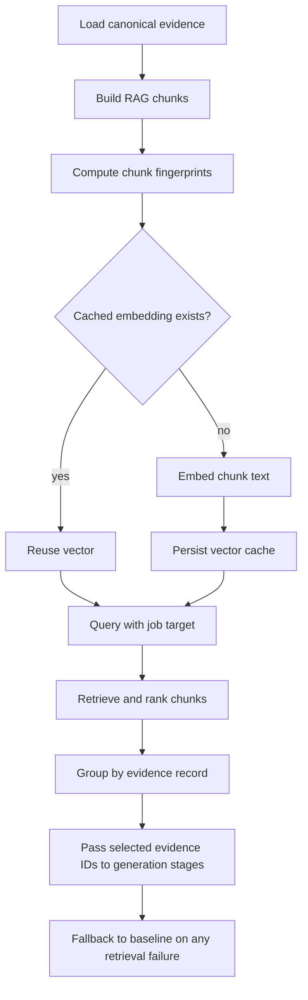

# RAG Mode Plan

This document explores how retrieval-augmented generation could fit ResumeCR7.
It is intentionally a planning document: it lays out goals, constraints, design
options, and a staged implementation path before any architecture is locked in.

## Why RAG Fits

ResumeCR7 already has the most important prerequisite for useful RAG: structured,
user-authored evidence. A RAG layer can improve selection and tailoring by
retrieving the most relevant evidence for a target job before generation runs.

The retrieval system should not become the source of truth. It should help the
pipeline find evidence; it should not invent claims, skills, dates, metrics, or
project scope.

Good uses for RAG:

- Find the projects, roles, highlights, skills, and education entries most
  relevant to a job description.
- Improve project and experience selection without scanning every record through
  an LLM.
- Give bullet generation a smaller, better-grounded context window.
- Explain why evidence was selected by carrying record IDs, fields, and scores
  through the pipeline.
- Support future local-model generation by making prompts smaller and more
  focused.
- Power workbench search, evidence coverage checks, and "why this resume?"
  inspection views.

Poor uses for RAG:

- Free-form chatting over a resume without preserving evidence provenance.
- Treating generated bullets as canonical evidence.
- Filling gaps in the user's career history from model guesses.
- Replacing deterministic baseline selection before the retrieval path has tests
  and measured value.

## Product Constraints

RAG mode must preserve the existing project invariants:

- Never invent resume claims or skills.
- Keep user-authored evidence separate from generated artifacts.
- Preserve deterministic baseline behavior when retrieval, embeddings, local
  models, or external APIs fail.
- Keep strict skill category boundaries: `technology`, `programming`, and
  `concepts`.
- Avoid introducing database-backed persistence unless the architecture is
  intentionally updated.
- Do not add LLM dependencies without baseline success, evaluation data, and
  measured improvement.

## Where RAG Could Help

### 1) Evidence Retrieval For Resume Generation

Input:

- `job_role`
- `job_description`
- optional generation config
- canonical resume evidence from `user/resume_evidence/*.yaml`

Output:

- ranked evidence chunks with stable IDs
- provenance metadata
- retrieval scores
- reason strings in development mode

The resume generation pipeline can then use retrieved evidence for:

- skill selection
- project selection
- job-focus derivation
- project bullet generation
- experience bullet generation
- tailoring audit

### 2) Better Project And Experience Selection

Today selection is split into deterministic baseline and optional model-backed
rankers. RAG can act as a first-pass retrieval stage:

```text
job target -> retrieve candidate evidence -> deterministic/LLM rerank -> selected records
```

This keeps the final selection inspectable and keeps fallback behavior simple.

### 3) Smaller Prompts For Local Models

Local models are usually more sensitive to context size, latency, and prompt
noise. A retrieval layer can keep local prompts focused:

```text
job target + top evidence chunks + strict instructions -> grounded output
```

This is a better fit than sending all evidence to a small local model.

### 4) Evidence Coverage And Gap Analysis

RAG can support non-generation features:

- Find evidence that supports a job requirement.
- Show requirements that have weak or missing evidence.
- Detect skills listed globally but weakly supported by project or experience
  records.
- Suggest where the user may want to add evidence, without generating the
  evidence for them.

### 5) Workbench Search

The same index can power semantic search in the UI:

- "show backend performance work"
- "find cloud projects"
- "which experience mentions deployment?"

This is useful even if RAG is not enabled for final resume generation.

## Retrieval Unit Design

The first design choice is what gets embedded and retrieved.

### Option A: Record-Level Retrieval

Each project, experience entry, education entry, and skill category becomes one
retrievable document.

Pros:

- Simple to build and test.
- Easy provenance: every result maps to one existing record.
- Low storage and indexing complexity.
- Good fit for current project scale.

Cons:

- Less precise when one record has many unrelated highlights.
- May include extra context in bullet prompts.

Best first use:

- Project selection.
- Experience selection.
- Workbench semantic search.

### Option B: Field-Level Retrieval

Each summary, highlight, skill list, link enrichment result, and education
coursework item becomes its own retrievable chunk.

Pros:

- More precise context.
- Better for bullet generation and requirement coverage.
- Helps identify the exact evidence line that supports a claim.

Cons:

- More indexing metadata.
- Requires careful grouping back into resume records.
- More risk of overfitting to isolated phrases.

Best first use:

- Requirement-to-evidence matching.
- Bullet generation context.
- Evidence support audits.

### Option C: Hybrid Record And Field Retrieval

Index both whole records and smaller fields. Retrieve field chunks first, then
group and score by parent record.

Pros:

- Good balance of precision and stable record selection.
- Supports explainability at both record and field level.
- Scales naturally as evidence grows.

Cons:

- More implementation work.
- Needs clear ranking and tie-break rules.

Best first use:

- A mature RAG mode after record-level retrieval proves useful.

Recommended starting point: Option A, with the data model designed so Option B
can be added without rewriting the interface.

## Provider And Storage Options

### Option 1: Local JSON Vector Cache

Store embeddings and chunk metadata in files under ignored runtime data, similar
to existing cache behavior.

Likely shape:

```text
user/cache/rag/
  index.json
  vectors.json
```

Pros:

- Local-first.
- No new database dependency.
- Easy to inspect and reset.
- Fits current project scale.

Cons:

- Linear search is acceptable only while evidence is small.
- Concurrency and partial writes need careful handling.
- Not ideal for very large corpora.

Good for:

- First implementation.
- Evaluation experiments.
- Desktop/local workflow.

### Option 2: SQLite With Vector Extension

Use SQLite for chunk metadata and vector search, potentially with a vector
extension if available.

Pros:

- Durable local storage.
- Better indexing and query flexibility.
- Easier metadata filtering than raw JSON.

Cons:

- Adds database-backed persistence, which is currently outside the architecture
  unless intentionally approved.
- Extension availability can complicate packaging.
- More migration surface.

Good for:

- Later local-first scale-up if JSON cache becomes limiting.

### Option 3: Embedded Vector Library

Use a local in-process vector index such as FAISS, hnswlib, LanceDB, Chroma, or
similar tooling.

Pros:

- Fast approximate nearest-neighbor search.
- Better for larger evidence libraries.
- Some tools include metadata filtering.

Cons:

- Adds heavier dependencies.
- Packaging may be harder for desktop releases.
- Might be unnecessary for the current project scale.

Good for:

- Larger personal evidence bases.
- Multi-resume archives.
- Experiments that prove vector search latency matters.

### Option 4: External Vector Database Or Hosted RAG

Use a hosted system such as Pinecone, Weaviate Cloud, Supabase vector search, or
a managed provider-integrated retrieval API.

Pros:

- Operationally powerful.
- Handles scale, indexing, and vector search APIs.
- Useful for collaborative or multi-device future products.

Cons:

- Weak fit for local-first privacy.
- Requires network availability and credentials.
- Introduces sync, deletion, and data governance concerns.
- Overkill for a single-user desktop evidence workbench.

Good for:

- Future hosted/team edition, not the first local RAG mode.

Recommended starting point: Option 1.

## Embedding Provider Options

### External API Embeddings

Examples:

- OpenAI embedding models
- Voyage
- Cohere
- Jina

Pros:

- High quality.
- Simple API shape.
- No local model setup.

Cons:

- Sends career evidence to an external service.
- Requires API keys and network access.
- Cost and rate limits need tracking.

Best use:

- Opt-in high-quality mode.
- Evaluation baseline for retrieval quality.

### Local Embeddings

Examples:

- sentence-transformers through Python
- Ollama embedding models
- llama.cpp-compatible embedding models

Pros:

- Preserves local-first posture.
- Works offline after model setup.
- Good match for desktop users who care about privacy.

Cons:

- Dependency and packaging complexity.
- Model quality varies.
- CPU-only latency may be noticeable.

Best use:

- Default long-term RAG path if quality is acceptable.

### Lexical Retrieval First

Use deterministic keyword, synonym, and role-profile scoring before embeddings.

Pros:

- No new provider.
- Deterministic.
- Transparent.
- Already aligned with baseline scoring.

Cons:

- Misses semantic matches.
- Less useful for broad natural-language job descriptions.

Best use:

- Required fallback.
- Hybrid score component alongside vector similarity.

Recommended provider plan:

1. Start with lexical plus optional external embeddings, because the project
   already has an embedding client path.
2. Add a provider interface that can later support local embeddings.
3. Keep lexical retrieval as the fallback for every RAG call.

## Proposed Architecture

Add a new subsystem:

```text
app/rag/
  models.py
  chunking.py
  index.py
  retrieval.py
  providers.py
  service.py
```

Responsibilities:

- `models.py`: typed chunk, index, query, and retrieval result schemas.
- `chunking.py`: convert canonical evidence into retrievable chunks.
- `index.py`: build, load, validate, and refresh the local index.
- `providers.py`: embedding provider interface and implementations.
- `retrieval.py`: score, sort, filter, and group retrieval results.
- `service.py`: API/service wrapper used by resume generation and future routes.

The subsystem should depend on `app.resume_evidence` models, but generation
stages should consume retrieval results through typed RAG models rather than
reading index internals.

High-level flow:



## Retrieval Result Shape

A retrieval result should carry enough provenance to audit output:

```yaml
chunk_id: project:resumecr7
source_type: project
source_id: resumecr7
field: record
text: "ResumeCR7 is a local-first career evidence workbench..."
score:
  lexical: 0.42
  vector: 0.81
  combined: 0.72
matched_terms:
  - FastAPI
  - local-first
reason: "Matched backend API, local-first storage, and generation workflow terms."
```

Generation artifacts should record the retrieval inputs used for a run:

- index fingerprint
- embedding provider and model
- query text fingerprint
- selected chunk IDs
- selected evidence IDs
- scores
- fallback warnings

## Ranking Strategy

For deterministic behavior, ranking should use explicit tie-breaks:

1. combined score descending
2. source priority, if configured
3. active records before inactive records
4. stable source type order
5. stable source ID
6. stable field name

Combined scoring can start simple:

```text
combined = 0.65 * vector_similarity + 0.35 * lexical_score
```

If embeddings are unavailable:

```text
combined = lexical_score
```

The exact weights should be evaluated rather than guessed long-term.

## Generation Integration Options

### Integration A: Advisory Retrieval

RAG runs before existing selection. It provides ranked candidates and metadata,
but existing baseline and LLM selection still make final decisions.

Pros:

- Lowest risk.
- Easy fallback.
- Lets us compare RAG with current behavior.

Cons:

- Value may be muted until downstream stages use the context deeply.

### Integration B: RAG-Backed Selection Method

Add a selection method such as `PROJECT_METHOD=rag` or
`RESUME_GENERATION_SELECTION_METHOD=rag`.

Pros:

- Clear user-facing behavior.
- Easy to evaluate against baseline and LLM selection.

Cons:

- Needs stronger tests before becoming default.

### Integration C: RAG Context For Generation Prompts

Bullet and job-focus generation receive retrieved chunks directly.

Pros:

- Strongest generation quality upside.
- Smaller prompts for local models.

Cons:

- Highest grounding risk if prompts do not enforce source IDs.
- Needs output validation that generated bullets cite selected evidence.

Recommended implementation order:

1. Advisory retrieval.
2. RAG-backed project and experience selection.
3. RAG context for bullet generation once provenance checks exist.

## API And Configuration Sketch

Config values could be added gradually:

```text
RAG_ENABLED=false
RAG_PROVIDER=lexical|openai|local
RAG_EMBEDDING_MODEL=text-embedding-3-small
RAG_INDEX_PATH=user/cache/rag/index.json
RAG_TOP_K=12
RAG_VECTOR_WEIGHT=0.65
RAG_LEXICAL_WEIGHT=0.35
RAG_DEV_MODE=false
```

Potential internal service request:

```yaml
job_role: "Backend Engineer"
job_description: "..."
top_k: 12
source_types:
  - project
  - experience
  - education
include_inactive: false
dev_mode: true
```

Potential response:

```yaml
results:
  - chunk_id: project:resumecr7
    source_type: project
    source_id: resumecr7
    score:
      combined: 0.72
      vector: 0.81
      lexical: 0.42
warnings: []
```

## Evaluation Plan

Before RAG becomes a default path, create a small durable evaluation set under
`data/` using fictional evidence:

- job targets
- expected relevant projects
- expected relevant experience entries
- required and nice-to-have skills
- expected unsupported requirements

Metrics:

- top-k recall for relevant evidence
- precision of selected records
- unsupported-claim rate in generated bullets
- prompt token count
- generation latency
- fallback rate

Qualitative review:

- Are selected records defensible?
- Are weak matches explainable?
- Did RAG improve the final resume, or only change it?
- Did local models benefit from smaller prompts?

## Staged Implementation

### Phase 0: Design And Fixtures

- Create this planning document.
- Define fictional evaluation fixtures.
- Decide first provider and storage option.
- Identify the first generation stage to integrate.

### Phase 1: Local Lexical RAG Skeleton

- Add `app/rag` typed models.
- Convert evidence records into record-level chunks.
- Implement deterministic lexical retrieval.
- Add focused tests for chunking, ranking, filtering, and tie-breaks.
- Add an internal service call, but do not change default generation behavior.

### Phase 2: Optional Embedding Retrieval

- Reuse or generalize the existing embedding client/cache where practical.
- Add vector scoring with lexical fallback.
- Persist local vector cache under ignored runtime data.
- Add tests for cache invalidation by chunk fingerprint and provider settings.
- Record retrieval metadata in generation artifacts when enabled.

### Phase 3: Advisory Generation Integration

- Run RAG before selection when `RAG_ENABLED=true`.
- Pass ranked candidate IDs to project and experience selection.
- Preserve baseline output when RAG fails.
- Add dev-mode warnings and retrieval traces.
- Evaluate against fictional job targets.

### Phase 4: RAG Selection Mode

- Add explicit RAG selection method for project and/or experience selection.
- Compare baseline, embeddings, LLM, and RAG paths.
- Tune ranking weights using evaluation fixtures.
- Update architecture docs once the subsystem boundary is stable.

### Phase 5: Local Model And Prompt Context Experiments

- Add local embedding provider support.
- Add local generation provider support only after baseline success is measured.
- Feed retrieved chunks into job-focus and bullet generation prompts.
- Require selected evidence IDs in generated output metadata.

## Open Questions

- Should RAG retrieve only active records by default?
- Should generated artifacts ever be indexed for search, while remaining separate
  from user-authored evidence?
- Should link enrichment summaries become retrievable chunks?
- Should global skills be retrievable alone, or only through projects and
  experience that support them?
- What is the minimum useful local embedding model for the desktop app?
- How much provenance should be visible in the workbench UI?
- Should RAG mode be configured globally, per run, or both?

## Recommended First Choice

Start with a local-first, record-level RAG skeleton:

- storage: local JSON cache under ignored runtime data
- retrieval: deterministic lexical scoring first
- embeddings: optional second phase using the existing embedding provider shape
- integration: advisory retrieval before project and experience selection
- fallback: current baseline behavior
- evaluation: fictional job-target fixtures before any default behavior changes

This gives the project useful retrieval capabilities without violating the
current architecture. It also creates the right interface for future local
models, stronger vector search, or a fuller RAG-backed generation mode.
